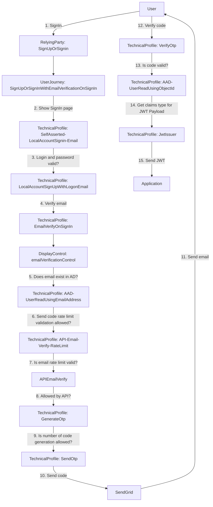
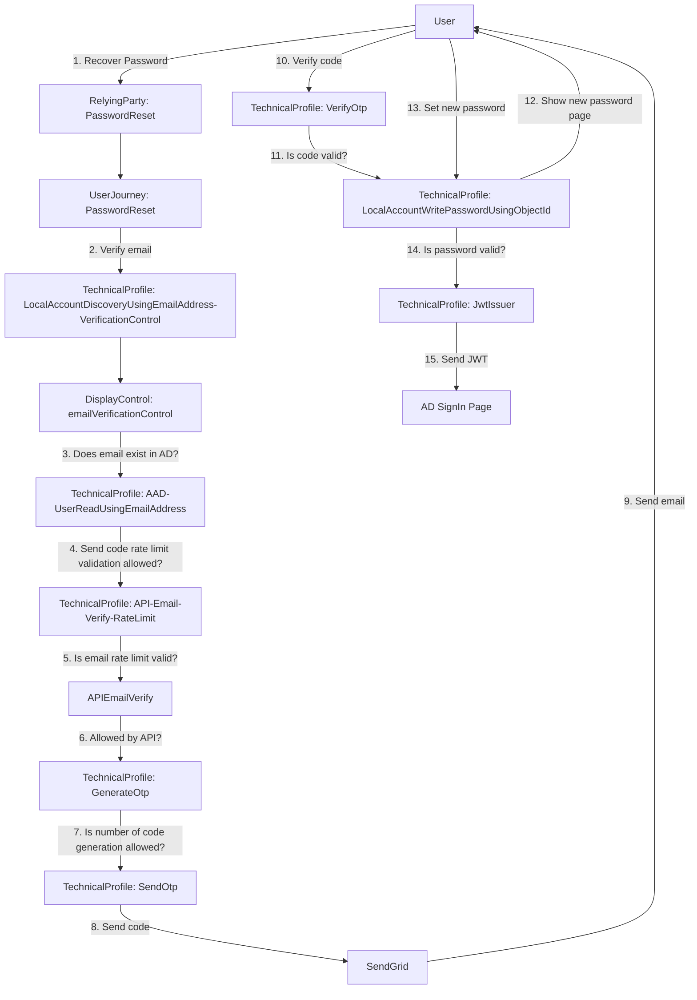

# **Azure AD B2C - Custom Policies**

## 📘 **Overview**

Implementation of **Custom Policies** in **Azure Active Directory B2C (Azure AD B2C)**.

## 🧠 **Key Concepts**

Custom Policies include the following components:

- **TrustFrameworkBase.xml**: Defines common reusable elements across all policies, such as Claims, ClaimsTransformations, and TechnicalProfiles.
- **TrustFrameworkExtensions.xml**: Extends TrustFrameworkBase with application-specific configurations.
- **Policy Files** (e.g., `SignUpOrSignin.xml`, `PasswordReset.xml`, `ProfileEdit.xml`): Define user interaction and authentication flows.
- **Claims**: Information about the user, such as name, email, etc.
- **ClaimsTransformations**: Rules to modify or validate Claims.
- **TechnicalProfiles**: Define how data is collected, validated, and persisted (e.g., REST APIs, Azure AD).
- **OrchestrationSteps**: Steps that make up the authentication flow.

## 🚀 **Getting Started**

To start using Custom Policies in Azure AD B2C:

1. Install extension in VS Code [VS Code AD B2C Extension](https://github.com/azure-ad-b2c/vscode-extension/tree/master).
2. Added `appsettings.json` and configure.
3. Register **Identity Experience Framework** applications in Azure AD B2C.
4. Download the **Custom Policy Starter Pack** from GitHub.
5. Customize the XML policy files according to your business logic.
6. Execute the command `B2C Build All Policies` in VS Code Command Palette.
7. Upload the policies to your Azure AD B2C tenant from folder `Environments` (e.g., `Test` or `Production`).
8. Test: Navigate to **Custom Policies** → select the user journey (e.g., `B2C_1A_signup_signin`).

> **Note:** Avoid modifying the `TrustFrameworkBase.xml` file prefer changing the `TrustFrameworkExtensions.xml`. If you do, make sure to comment your changes.

---

## ✅ **What I Implemented**

1. Installed extension [VS Code AD B2C Extension](https://github.com/azure-ad-b2c/vscode-extension/tree/master)
2. Added `appsettings.json` and configured.
3. Used the AD B2C Starter Pack → LocalAccounts as the base.
4. Registered **IdentityExperienceFramework** and **ProxyIdentityExperienceFramework** applications in Azure AD B2C (Azure AD B2C -> Policies -> Identity Experience Framework -> Manage -> App registrations)
5. Created Policy Keys `B2C_1A_TokenSigningKeyContainer` and `B2C_1A_TokenEncryptionKeyContainer` (Azure AD B2C -> Policies -> Identity Experience Framework -> Manage -> Policy Keys).
6. Registered the **JWT.ms** application (used to display the JWT generated during authentication for testing user journeys).
7. Modified `SignUpOrSignIn` to **hide the Sign-Up option**.
8. Updated `SignUpOrSignIn` to **trigger email verification**.
9. Added **Remember Me** option to `SignUpOrSignIn`.
10. Changed **session expiration time**.
11. Added **custom page layout** to `SignUpOrSignIn` with JavaScript rules to show/hide buttons.
12. Added **custom page layout** to `PasswordReset` with JavaScript rules for button visibility and password formatting.
13. Updated email verification to use **SendGrid** via REST API calls.
14. Created a **dynamic email template** in SendGrid. Added key `{{subject}}` in email template subject.
15. Generated an **API Key** in SendGrid and registered it in the Azure AD B2C Policy Keys `B2C_1A_SendGridSecret` (Azure AD B2C -> Policies -> Identity Experience Framework -> Manage -> Policy Keys).
16. Updated email verification in `SignUpOrSignIn` and `PasswordReset` to use OTP SendGrid REST API.
17. Changed OTP configurations:
    - Password characters to `a-z0-9A-Z`
    - Number of code generation attempts to `3`
    - Number of verification retries attemples to `2`
18. Added a check to verify if the email exists in Azure AD before sending the verification email.
19. Created an API to **limit verification requests per email**
    - Method `GET` receiving `email` from query.
    - Basic Authentication
    - Return `allowed` (boolean) - If user is allowed to continue the process.
20. Registered the API Basic Authentication `username` in `B2C_1A_ConnectorUsername` (Azure AD B2C -> Policies -> Identity Experience Framework -> Manage -> Policy Keys).
21. Registered the API Basic Authentication `password` in `B2C_1A_ConnectorPassword` (Azure AD B2C -> Policies -> Identity Experience Framework -> Manage -> Policy Keys).
22. Integrated the API to enforce **rate limiting** for email verification calls.
23. Added in JWT Payload the properties `email` and `emails`

---

## Folder Structure

```
/custom-policy -> Azure AD B2C Custom Policy configuration files
/page-layout   -> Html, CSS, JS and Images of Sign In and Password Reset page
/sendgrid      -> SendGrid E-mail verification template
```

> SignIn and Password Reset implementation located in:
> `TrustFrameworkExtensions.xml`: Main login
> `SignUpOrSignIn.xml`: SignIn start page
> `PasswordReset.xml`: Password Reset start page

---

## 🔧 **VS Code Extension Configuration**

In `appsettings.json` configure:

```json
{
  "Environments": [
    {
      "Name": "Test",
      "Production": false,
      "Tenant": "your-tenant.onmicrosoft.com",
      "PolicySettings": {
        "IdentityExperienceFrameworkAppId": "ief-appid",
        "ProxyIdentityExperienceFrameworkAppId": "pief-appid",
        "PageLayoutNewPassword": "page-layout-new-password-url",
        "PageLayoutSignIn": "page-layout-signin-url",
        "PageLayoutSignInMfaEmail": "page-layout-signin-mfa-email-url",
        "SendGridEmailTemplateId": "sendgrid-email-templateid",
        "SendGridFromEmail": "sendgrid-from-email",
        "SendGridSubject": "sendgrid-subject",
        "ApiEmailVerify": "api-email-verify-url"
      }
    },
    {
      "Name": "Production",
      "Production": true,
      "Tenant": "your-tenant.onmicrosoft.com",
      "PolicySettings": {
        "IdentityExperienceFrameworkAppId": "ief-appid",
        "ProxyIdentityExperienceFrameworkAppId": "pief-appid",
        "PageLayoutNewPassword": "page-layout-new-password-url",
        "PageLayoutSignIn": "page-layout-signin-url",
        "PageLayoutSignInMfaEmail": "page-layout-signin-mfa-email-url",
        "SendGridEmailTemplateId": "sendgrid-email-templateid",
        "SendGridFromEmail": "sendgrid-from-email",
        "SendGridSubject": "sendgrid-subject",
        "ApiEmailVerify": "api-email-verify-url"
      }
    }
  ]
}
```

| Variable                                               | Description                                                                                                                                                                                                                                            | Example                                |
| ------------------------------------------------------ | ------------------------------------------------------------------------------------------------------------------------------------------------------------------------------------------------------------------------------------------------------ | -------------------------------------- |
| `Name`                                                 | Environment name                                                                                                                                                                                                                                       | `Test`, `Production`                   |
| `Production`                                           | Is Production Environment                                                                                                                                                                                                                              | `true`, `false`                        |
| `Tenant`                                               | AD Tenant name.<br/> **Where is locate?**<br/> Azure AD B2C -> Overview -> Domain name                                                                                                                                                                 | `your-tenant.onmicrosoft.com`          |
| `PolicySettings:IdentityExperienceFrameworkAppId`      | Identity Experience Framework Application ID.<br/> **Where is locate?**<br/> Azure AD B2C -> Policies -> Identity Experience Framework -> Manage -> App registrations -> IdentityExperienceFramework -> Overview -> Application (client) ID            | `67205fff-ccae-47b4-8eea-1d2124c6b4a4` |
| `PolicySettings:ProxyIdentityExperienceFrameworkAppId` | Proxy Identity Experience Framework Application ID.<br/> **Where is locate?**<br/> Azure AD B2C -> Policies -> Identity Experience Framework -> Manage -> App registrations -> ProxyIdentityExperienceFramework -> Overview -> Application (client) ID | `312ce323-0657-486f-9407-e955c24fb8db` |
| `PolicySettings:PageLayoutNewPassword`                 | Custom Page Layout URL of Password Reset Journey                                                                                                                                                                                                       | `https://page-layout-password-reset`   |
| `PolicySettings:PageLayoutSignIn`                      | Custom Page Layout URL of Sign In Journey                                                                                                                                                                                                              | `https://page-layout-signin`           |
| `PolicySettings:PageLayoutSignInMfaEmail`              | Custom Page Layout URL of Sign In with MFA Journey                                                                                                                                                                                                     | `https://page-layout-signin-mfa`       |
| `PolicySettings:SendGridEmailTemplateId`               | SendGrid dynamic email template ID.<br/> **Where is locate?**<br/> SendGrid App Page -> Email API -> Dymanic Templates -> Your Template -> Template ID                                                                                                 | `d-efc4dd9a07c344a99f799532d1e33fc6`   |
| `PolicySettings:SendGridFromEmail`                     | SendGrid email from                                                                                                                                                                                                                                    | `your-email@email.com`                 |
| `PolicySettings:SendGridSubject`                       | SendGrid email subject                                                                                                                                                                                                                                 | `Verify your account`                  |

---

## 🖼 Architecture Diagram

### SignIn



### Password Reset



---

## 🔗 **Useful References**

- [Overview of Custom Policies](https://learn.microsoft.com/en-us/azure/active-directory-b2c/custom-policy-overview)
- [Custom Policy Concepts](https://azure-ad-b2c.github.io/azureadb2ccommunity.io/docs/custom-policy-concepts/)
- [Tutorial: Create User Flows with Custom Policies](https://learn.microsoft.com/en-us/azure/active-directory-b2c/tutorial-create-user-flows?pivots=b2c-custom-policy)
- [Identity Experience Framework App Configuration](https://learn.microsoft.com/en-us/azure/active-directory-b2c/tutorial-create-user-flows?pivots=b2c-custom-policy#register-identity-experience-framework-applications)
- [VS Code Extension](https://github.com/azure-ad-b2c/vscode-extension/tree/master)
- [Application Insights Troubleshooting](https://learn.microsoft.com/en-us/azure/active-directory-b2c/troubleshoot-with-application-insights?pivots=b2c-custom-policy)
- [GitHub Samples](https://github.com/azure-ad-b2c/samples)
- [Custom Policy Starter Pack](https://github.com/Azure-Samples/active-directory-b2c-custom-policy-starterpack)
- [Enable Javascript](https://learn.microsoft.com/en-us/azure/active-directory-b2c/javascript-and-page-layout?pivots=b2c-custom-policy)
- [OTP](https://learn.microsoft.com/en-us/azure/active-directory-b2c/one-time-password-technical-profile)
- [Send verification code with Send Grid](https://learn.microsoft.com/en-us/azure/active-directory-b2c/custom-email-sendgrid?pivots=b2c-custom-policy)
